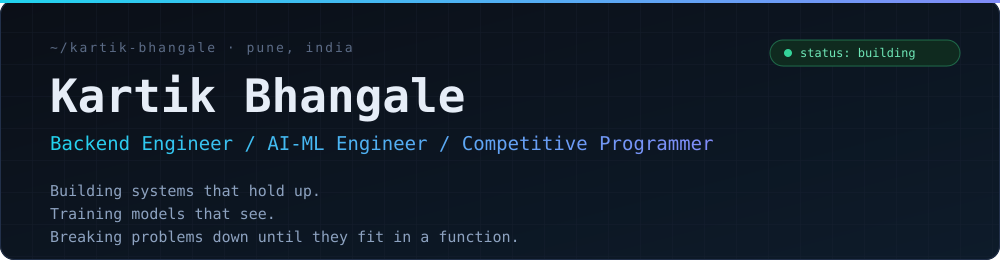
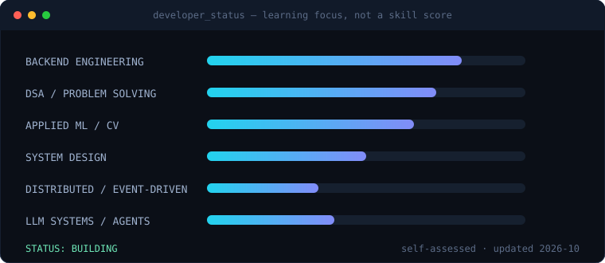
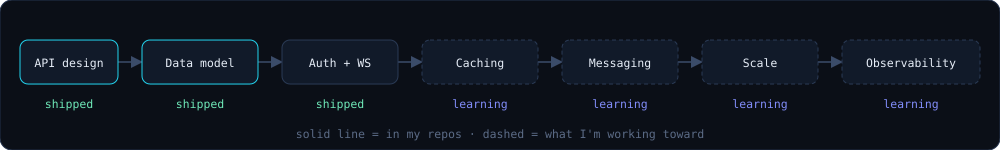

<div align="center">



<br/>

[](https://github.com/fenixftw6968)
[](mailto:kartikbhangale20@gmail.com)
[](https://algo-arena-chi.vercel.app/)
<!-- ADD LinkedIn: [](https://www.linkedin.com/in/YOUR-HANDLE) -->

</div>

<br/>

I build backends that handle real traffic patterns (auth, real-time matches, ranking) and ML systems that do something useful with their output (medical imaging with explainability, a privacy-preserving browser agent).

Right now I'm pushing past CRUD toward **event-driven design, caching and observability**, while keeping my algorithms sharp on LeetCode.

<br/>

## `> currently_building`

| | Focus | Why it matters |
|:--|:--|:--|
| **01** | Production-grade Spring Boot services | Moving from "it works" to tested, containerised and secure by default. |
| **02** | System design and event-driven architecture | Kafka, caching and failure modes are next, after JWT and WebSockets. |
| **03** | LLM-powered agents | Extending [Rakshak](https://github.com/fenixftw6968/rakshak2.0) and [IntelliQ](https://github.com/fenixftw6968/IntelliQ) toward evaluated, reliable agent behaviour. |
| **04** | Daily problem solving | [200+ LeetCode problem folders](https://github.com/fenixftw6968/leetcode-codes), mostly C++. |

<br/>

## `> featured_projects`

<table>
<tr>
<td width="50%" valign="top">

### [AlgoArena](https://github.com/fenixftw6968/AlgoArena)
**Competitive brain-training platform with real-time matches.**

Players solve timed puzzles, earn XP, climb leaderboards, chat and challenge friends.

- JWT auth on Spring Security, with password-reset tokens and transactional email
- WebSocket matches and live chat, plus an Elo rating service
- 14 JPA entities on PostgreSQL, DTO layer, global exception handling
- Unit tests for the Elo, match and question-history services
- Dockerised backend and frontend (nginx) with `docker-compose`

`Java 21` `Spring Boot` `Spring Security` `WebSocket` `PostgreSQL` `Docker` `React`

[Code](https://github.com/fenixftw6968/AlgoArena) · [Live demo](https://algo-arena-chi.vercel.app/)

</td>
<td width="50%" valign="top">

### [Rakshak 2.0](https://github.com/fenixftw6968/rakshak2.0)
**A privacy-first AI browser agent.**

Sensitive data (PII, faces, credentials) is detected and redacted on-device, so only sanitised context reaches the LLM.

- Chrome extension with on-device vision, OCR and PII-detection modules
- Defence in depth: client-side redaction plus a server-side sanitisation validator
- FastAPI reasoning server on Gemini, with a `pytest` suite
- Privacy dial, redaction audit log and a panic-mode kill switch

`Python` `FastAPI` `Gemini` `JavaScript` `Browser extension` `Computer vision`

[Code](https://github.com/fenixftw6968/rakshak2.0)

</td>
</tr>
<tr>
<td width="50%" valign="top">

### [X-Ray / MRI Med Vision AI](https://github.com/fenixftw6968/X_Ray_MRI_Med_Vision_AI)
**Medical image classification with explainability.**

Two trained Keras models (X-ray and MRI) served through a Flask app.

- Grad-CAM heatmaps show *where* the model looked, not just what it predicted
- Preprocessing pipeline and training notebooks included
- Database layer and `gunicorn` Procfile for deployment

`Python` `TensorFlow/Keras` `Grad-CAM` `Flask` `OpenCV`

[Code](https://github.com/fenixftw6968/X_Ray_MRI_Med_Vision_AI)

</td>
<td width="50%" valign="top">

### [E-Commerce Platform](https://github.com/fenixftw6968/E-Commerce-Platform)
**Full-stack store with role-based access.**

React storefront on a Spring Boot REST API.

- JWT authentication, Spring Security and protected routes
- Cart, checkout, order tracking and admin product management
- PostgreSQL via Spring Data JPA, Dockerfile included

`Java 17` `Spring Boot` `JWT` `PostgreSQL` `React` `Docker`

[Code](https://github.com/fenixftw6968/E-Commerce-Platform) · [Live demo](https://e-commerce-azure-eight-27.vercel.app)

</td>
</tr>
</table>

<details>
<summary><b>More repositories</b></summary>
<br/>

| Repo | What it is |
|:--|:--|
| [IntelliQ](https://github.com/fenixftw6968/IntelliQ) | AI assistant client in TypeScript: Gemini and OpenAI with bring-your-own-key, split-screen canvas editor, LaTeX, speech input. |
| [InventoryManagementSystem](https://github.com/fenixftw6968/InventoryManagementSystem) | Spring Boot, JPA and PostgreSQL REST API with Product/Category/Supplier relations. |
| [Job-Application-Tracker](https://github.com/fenixftw6968/Job-Application-Tracker) | Spring Boot and React tracker for job applications. |
| [Student-Management-System](https://github.com/fenixftw6968/Student-Management-System) | Spring Boot CRUD application. |
| [RagePredictor](https://github.com/fenixftw6968/RagePredictor) | Predicts whether a gamer will rage-quit from K/D ratio, duration, messages, death streak and score difference. |
| [Bangalore-House-Price-Predictor](https://github.com/fenixftw6968/Bangalore-House-Price-Predictor) | Regression model for Bangalore house prices. |

</details>

<br/>

## `> developer_status`

<div align="center">

</div>

<br/>

## `> engineering_stack`

Only what appears in my repositories.

| Layer | Tools |
|:--|:--|
| **Languages** |       |
| **Backend** |        |
| **Data** |  |
| **AI / ML** |      |
| **Infra** |      |

<br/>

## `> beyond_crud`

<div align="center">

</div>

<br/>

**Shipped:** layered REST APIs, relational modelling, JWT auth, WebSocket real-time flows, Elo-based ranking, containerised deploys.
**Studying next:** caching strategies, Kafka and event-driven architecture, database optimisation, reliability patterns, observability.

<br/>

## `> ai_engineering`

I train and inspect models, not just call APIs.

| Area | Evidence |
|:--|:--|
| **Deep learning and computer vision** | Keras classifiers for X-ray and MRI with Grad-CAM explanations: [X_Ray_MRI_Med_Vision_AI](https://github.com/fenixftw6968/X_Ray_MRI_Med_Vision_AI) |
| **Classical ML** | Feature-based prediction and regression: [RagePredictor](https://github.com/fenixftw6968/RagePredictor), [Bangalore-House-Price-Predictor](https://github.com/fenixftw6968/Bangalore-House-Price-Predictor) |
| **LLM applications** | Multi-provider assistant with bring-your-own-key: [IntelliQ](https://github.com/fenixftw6968/IntelliQ) |
| **Agents and safety** | On-device PII redaction before any LLM call: [Rakshak 2.0](https://github.com/fenixftw6968/rakshak2.0) |
| **Learning next** | RAG, LLM evaluation, VLMs, transfer learning |

<br/>

## `> competitive_programming`

| | |
|:--|:--|
| **Solutions** | [leetcode-codes](https://github.com/fenixftw6968/leetcode-codes): 207 problem folders, mostly C++ (trees, graphs, DP) plus some SQL |
| **Approach** | Pattern first, then edge cases, then complexity. |
| **Profiles** | <!-- ADD: [LeetCode](https://leetcode.com/u/YOUR-HANDLE) · [Codeforces](https://codeforces.com/profile/YOUR-HANDLE) --> |

<br/>

## `> github_analytics`

<div align="center">


<br/><br/>


</div>

<br/>

## `> how_i_think`

```text
"Does it work?" is the starting line, not the finish.

  -> Can it scale?
  -> Can it fail safely?
  -> Can I observe it?
  -> Can I test it?
  -> Can someone else maintain it?
```

<br/>

<div align="center">

### Have an interesting system to build? Let's talk.

[](mailto:kartikbhangale20@gmail.com)
[](https://github.com/fenixftw6968)

</div>
